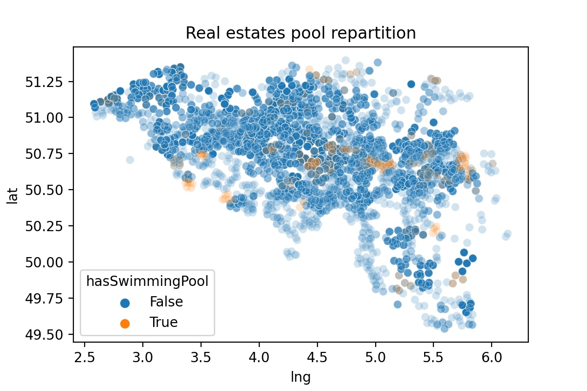
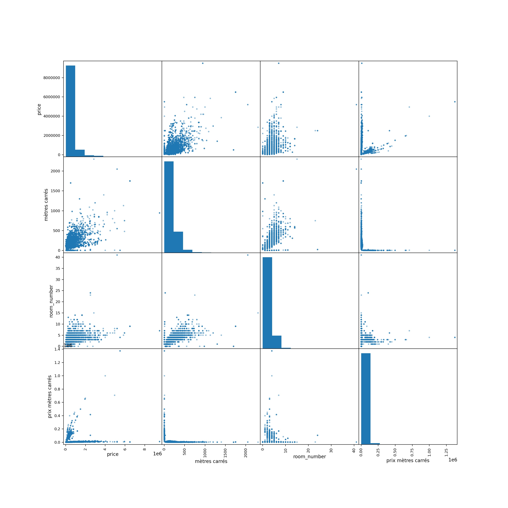
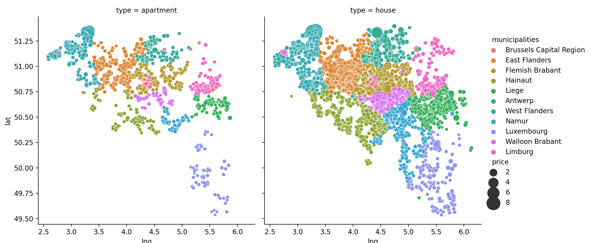
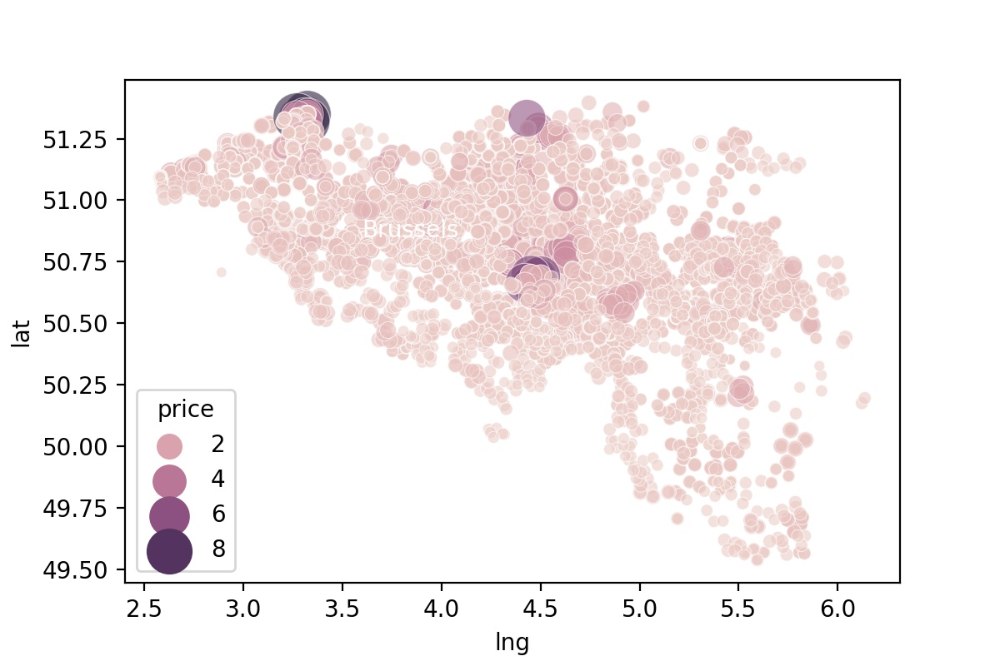

# Cleaning and building Process

> # 1. Immoweb Dataset

>This is our raw data directly scrapped from [Immoweb.be](https://www.immoweb.be/fr)
```
Column                         Non-Null Count  Dtype  
---  ------                         --------------  -----  
 0   id                             19855 non-null  int64  
 1   type                           19855 non-null  object 
 2   subtype                        19855 non-null  object 
 3   price                          19855 non-null  object 
 4   transactionType                19855 non-null  object 
 5   zip                            19855 non-null  int64  
 6   visualisationOption            19855 non-null  object 
 7   cuisine_type                   12904 non-null  object 
 8   constructionYear               11227 non-null  float64
 9   condition                      13434 non-null  object 
 10  heatingType                    12404 non-null  object 
 11  primaryEnergyConsumptionLevel  0 non-null      float64
 12  room_number                    18184 non-null  float64
 13  surface                        3350 non-null   float64
 14  atticExists                    2625 non-null   object 
 15  basementExists                 7597 non-null   object 
 16  hasSwimmingPool                528 non-null    object 
 17  indoor                         7041 non-null   float64
 18  outdoor                        5518 non-null   float64
 19  short_id                       19855 non-null  int64  
 20  company_name                   18738 non-null  object 
 21  m2                             19855 non-null  int64  
 22  commune                        19855 non-null  object 
```


> Percentage of missing values per column :
```
id                                 0.000000
type                               0.000000
subtype                            0.000000
price                              0.000000
transactionType                    0.000000
zip                                0.000000
visualisationOption                0.000000
cuisine_type                      35.008814
constructionYear                  43.455049
condition                         32.339461
heatingType                       37.527071
primaryEnergyConsumptionLevel    100.000000
room_number                        8.416016
surface                           83.127676
atticExists                       86.779149
basementExists                    61.737598
hasSwimmingPool                   97.340720
indoor                            64.537900
outdoor                           72.208512
short_id                           0.000000
company_name                       5.625787
m2                                 0.000000
commune                            0.000000
```
>_ie_ : the primaryEnergyConsumptionLevel column is empty in our datas.

>There is no duplicates is the dataset:
```
print(data.shape)
data.drop_duplicates(subset=None, keep="first",inplace=True)
print(data.shape)

(19855, 23)
(19855, 23)
```
>After exploring the dataset we deleted some columns because of  their high number of missing values or their irrelevance. 

>We also have deleteted certain subtype subset because they were corresponding to real estate projects.

>Some columns got rename for clarity.

>True/Nan type columns got filled with False

>We decided to work with a smaller dataset instead of a bigger one filled with mean values. If this approach doesnt suit you, we can still change that.

> # 2. ZipcodeBelgium Dataset

>Thanks to jief _[his github](https://github.com/jief/zipcode-belgium)_
We got our hands on a dataset  containing the long/lat of different belgians zipcode. We combine our first set. It  will allows us  to  plot some more visuals graphs.


```
```


> # 3. Adding communities
```
1000–1299: Brussels Capital Region
1300–1499: Walloon Brabant
1500–1999: Flemish Brabant
2000–2999: Antwerp
3000–3499: Flemish Brabant (continued)
3500–3999: Limburg
4000–4999: Liège
5000–5999: Namur
6000–6599: Hainaut
6600–6999: Luxembourg
7000–7999: Hainaut (continued)
8000–8999: West Flanders
9000–9999: East Flanders
```
>Source : Wikipedia(https://en.wikipedia.org/wiki/List_of_postal_codes_in_Belgium)
# Analysis

-----------------------------------------------------------
- Which variable is the target ?
>The target variable is "price"
-----------------------------------------------------------
- How many rows and columns ?
  
1. The dataframe with the qualitative values converted to binaries contains 11865rows and 64columns

2. The dataframe without the qualitative values converted to binaries contains 11865rows and 23columns
-----------------------------------------------------------

- What is the correlation between the variables and the target  ?(Why might that be?) 

1. mètres carrés                      0.559393
2. room_number                        0.427545
3. hasSwimmingPool                    0.316435
4. cuisine_type_is_hyper equipped     0.245090
5. subtype_is_exceptional property    0.245022
6. subtype_is_villa                   0.212008
7. lat                                0.205192
8. parking extérieur                  0.161731
9. basementExists                     0.153669
10. condition_is_as new                0.138350
>These are the first 10 variables who influence the price (the higher they get the higher the price is) in the dataframe with qualitatives values converted to binaries

1. mètres carrés         0.559393
2. room_number           0.427545
3. hasSwimmingPool       0.316435
4. lat                   0.205192
5. parking extérieur     0.161731
6. basementExists        0.153669
7. prix mètres carrés    0.136365
8. parking intérieur     0.057682
9. atticExists           0.051706
10. constructionYear     -0.021063
>These are the first 10 variables who influence the price(the higher they get the higher the price is) in the dataframe without qualitatives values converted to binaries

### We note that the first three are the same but the conversion into binaries give us more details on the correlation between some specificities in the goods and their prices.

# Visualization


------------------------------------------------------------
- What is the correlation between the variables and the other  variables ? (Why?)

------------------------------------------------------------
- Which variables have the greatest influence on the target ?

>The variables which have the greateast influence on the targ!et is the number of square meter.
------------------------------------------------------------
- Which variables have the least influence on the target ?

>The variables which have the greateast influence on the taret is the number of square meter.
------------------------------------------------------------
- How many qualitative and quantitative variables are there ? 

### The quantitative variables are in the following columns:
- id
- zip
- constructionYear
- room_number
- indoor
- outdoor
- m2

### The qualitative variables are in the foollowing columns :
- type
- subtype
- price (__some price are intervals__)
- cuisine_type
- condition
- company_name
- commune
>
- atticExists
- hasSwimmingPool
- basementExists
  >Those last three are actually True or Nan types. Got converted to booleans.

------------------------------------------------------------
- How would you transform these values into numerical values ?
  
> The qualitative values will be transformed using a one-hot-encoding.
------------------------------------------------------------

------------------------------------------------------------

# Interpretation :

- Are there any outliers? If yes, which ones and why?
  >They are some outliers. Mostly are _exceptional property_.
  - Mean price of all the goods: 494.214,496 euros.
  - Most expensive good is: 9.500.000 euros

------------------------------------------------------------
- Which variables would you delete and why ?
  >We have already deleted some non-relevants ones. At this stage we should probably separate the
  _exceptional property_ goods. Or even focus on the goods under one million. Client's choice.
-------------------------------------------------------------
- In your opinion, which 5 variables are the most important and why?
    >The most important 5 variables are the number of square meter, the number of rooms, the subtype of the good, the location and if the type of kitchen is an hyper-equipped one.
-------------------------------------------------------------
- What are the most expensive municipalities in Belgium? (Average price, median price, price per square meter)
>The most expensives municipalities by an average price of goods in Belgium are :
> 1. Brussels Capital Region    for and Average  price of : 772830.84euros
> 2. Walloon Brabant            for and Average price of : 710033.00euros 
> 3. West Flanders              for and Average price of : 671794.52euros

>The most expensives municipalities by square meter price in Belgium are:
> 1. West Flanders              21923.108908euros/m2
> 2. East Flanders              16750.479530euros/m2
> 3. Antwerp                    12169.446681euros/m2

-------------------------------------------------------------
- What are the less expensive municipalities in Belgium? (Average price, median price, price per square meter)
>The less expensives municipalities by an qverage price of goods in Belgium are :
> 1. Luxembourg                 for and Average  price of : 273051.90euros
> 2. Hainaut                    for and Average price of : 279100.97euros 
> 3. Liege                      for and Average price of : 294888.53euros

>The less expensives municipalities by square meter price in Belgium are:
> 1. Liege                      2843.0586218euros/m2
> 2. Walloon Brabant            3992.524900euros/m2
> 3. Luxembourg                 6127.0158681euros/m2






>Remember that those data still contains _exceptionnal goods_ !
-------------------------------------------------------------
- What are the most expensive municipalities in Wallonia? (Average price, median price, price per square meter)
-------------------------------------------------------------
- What are the most expensive municipalities in Flanders? (Average price, median price, price per square meter)
-------------------------------------------------------------
- What are the less expensive municipalities in Wallonia? (Average price, median price, price per square meter)
-------------------------------------------------------------
- What are the less expensive municipalities in Flanders? (Average price, median price, price per square meter)
-----------------------------------------------------------


```


```

# Miscellaneous

> ## Price evolution based on construction Year

> ## Average price by cuisine type.
> 
> ## Type of real estate available in differents municipalities.
> 
> > ## Average price based on heating type.
> 